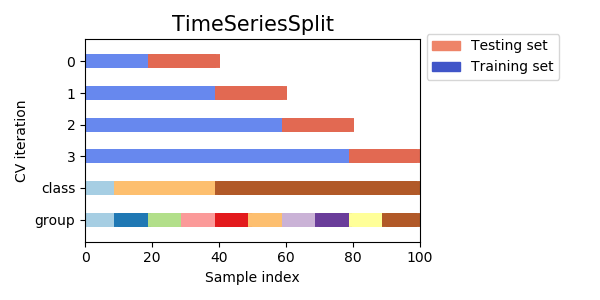

# 

# Problem statement

- approach: go towards desired split in small steps. Start with CV for time series data.

# CV for time series data
## superset approach (sklearn)

  - see: #  https://scikit-learn.org/stable/modules/generated/sklearn.model_selection.StratifiedKFold.html
  - 
##  moving window - period fold
[TODO generate analogue plot, create notebook for that purpose]

# Decisions for dev set:
- get samples from train set
- get samples from test set
- set ratio between train, de, and test samples

# Discussion of the options:

Plan for today:
- introduce multiplier
- introduce model optimization

