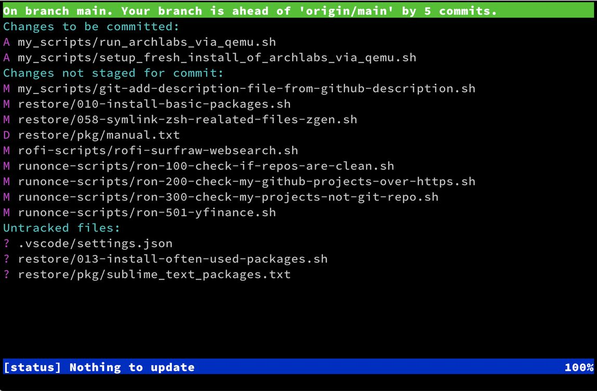
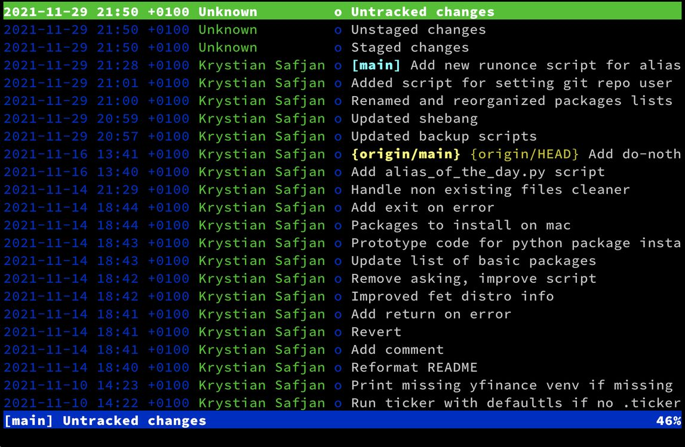

> There is a series of articles dedicated to Zsh plugins: [2018](../top-popular-zsh-plugins-on-github/), [2019](../top-popular-zsh-plugins-on-github-2019/), [2021](../top-popular-zsh-plugins-on-github-2021/)

The collection [Awesome Zsh plugins](https://github.com/unixorn/awesome-zsh-plugins) of projects that can be useful for Zsh users grew substantially from the first, 2018 release of my article on Top-popular Zsh plugins - from 800+ to 1800+.  In this article, I'm listing top-popular tools that might be interesting for Zsh users or in most cases any console users. I have divided them into four categories:

- **Tools** - general tools that are popular among console lovers, in most cases not limited to Zsh
- **Frameworks - tools for managing Zsh configuration and plugins** 
- **Prompts** - projects that help to configure shell prompts
- **Python tools** - tools that ease work with Python virtual environments

# GitHub Stars as an indicator of project popularity

One of the ways to estimate project popularity is to look at the number of stars. GitHub users often use stars as a kind of bookmark to mark interesting projects to come back to later. People that marked a project with a star are called "Star gazers". For sake of this article, to extract the "most popular" plugin projects I have used stars.

# Top popular plugins as of November 2021

| link                                                         | description of the Github project repo                       | stars |
| ------------------------------------------------------------ | ------------------------------------------------------------ | ----- |
| [thefuck](https://github.com/nvbn/thefuck)                   | Magnificent app which corrects your previous console command. | 64.9k |
| [fzf](https://github.com/junegunn/fzf)                       | A command-line fuzzy finder                                  | 40.6k |
| [bat](https://github.com/sharkdp/bat)                        | A cat(1) clone with wings.                                   | 30.5k |
| [ripgrep](https://github.com/BurntSushi/ripgrep)             | ripgrep recursively searches directories for a regex pattern while respecting your gitignore | 28.3k |
| [powerlevel10k](https://github.com/romkatv/powerlevel10k)    | A Zsh theme                                                  | 22.9k |
| [zsh-autosuggestions](https://github.com/zsh-users/zsh-autosuggestions) | Fish-like autosuggestions for zsh                            | 19.4k |
| [solarized](https://github.com/altercation/solarized)        | precision color scheme for multiple applications (terminal, vim, etc.) with both dark/light modes | 15.0k |
| [diff-so-fancy](https://github.com/so-fancy/diff-so-fancy)   | Good-lookin' diffs. Actually… nah… The best-lookin' diffs.   | 14.8k |
| [z](https://github.com/rupa/z)                               | z - jump around                                              | 13.7k |
| [powerlevel9k](https://github.com/bhilburn/powerlevel9k)     | Powerlevel9k was a tool for building a beautiful and highly functional CLI, customized for you. P9k had a substantial impact on CLI UX, and its legacy is now continued by P10k. | 13.3k |
| [autojump](https://github.com/wting/autojump)                | A cd command that learns - easily navigate directories from the command line | 13.2k |
| [zsh-syntax-highlighting](https://github.com/zsh-users/zsh-syntax-highlighting) | Fish shell-like syntax highlighting for Zsh.                 | 13.1k |
| [asdf](https://github.com/asdf-vm/asdf)                      | Extendable version manager with support for Ruby, Node.js, Elixir, Erlang & more | 12.4k |
| [ctop](https://github.com/bcicen/ctop)                       | Top-like interface for container metrics                     | 12.1k |
| [kubectx](https://github.com/ahmetb/kubectx)                 | Faster way to switch between clusters and namespaces in kubectl | 11.8k |
| [tmuxinator](https://github.com/tmuxinator/tmuxinator)       | Manage complex tmux sessions easily                          | 11.0k |
| [tig](https://github.com/jonas/tig)                          | Text-mode interface for git                                  | 10.4k |
| [navi](https://github.com/denisidoro/navi)                   | An interactive cheatsheet tool for the command-line          | 10.0k |
| [peco](https://github.com/peco/peco)                         | Simplistic interactive filtering tool                        | 6.6k  |

I have selected two projects that I haven't described in previous years but I'm happy user of both.

# 1. [diff-so-fancy](https://github.com/so-fancy/diff-so-fancy)

As authors call it `diff-so-fancy` strives to make your diffs human-readable instead of machine-readable. This helps improve code quality and helps you spot defects faster and it does what it promises. See the screenshot that compares vanilla `git diff` vs. `git` and `diff-so-fancy`.

You might have noticed that differences are spotted not only on line level but also on character level.

# 2. [tig](https://github.com/jonas/tig)

Tig is a ncurses-based text-mode interface for git. It functions mainly as a Git repository browser, but can also assist in staging changes for commit at the chunk level. Tig allows for convenient staging files in an interactive mode:

In the main view, you can interactively browse commit history and jump into inspecting selected commit.

Next to git-gui it is my favorite tool for staging git changes.

# Frameworks

Here is a quick glance at the most popular frameworks that manage configuration and plugins for Zsh. [Oh-my-zsh]((https://github.com/ohmyzsh/ohmyzsh)) regins here having ~10x stars compared to the closest contender [prezto](https://github.com/sorin-ionescu/prezto). 

|                                      link                                       |                                                                                                                                                                     description                                                                                                                                                                     |stars |
|---------------------------------------------------------------------------------|-----------------------------------------------------------------------------------------------------------------------------------------------------------------------------------------------------------------------------------------------------------------------------------------------------------------------------------------------------|------|
|[ohmyzsh](https://github.com/ohmyzsh/ohmyzsh)                                    | A delightful community-driven (with 1900+ contributors) framework for managing your Zsh configuration. Includes 300+ optional plugins (rails, git, macOS, hub, docker, homebrew, node, php, python, etc), 140+ themes to spice up your morning, and an auto-update tool that makes it easy to keep up with the latest updates from the community. |136.8k|
|[prezto](https://github.com/sorin-ionescu/prezto)                                |The configuration framework for Zsh                                                                                                                                                                                                                                                                                                                  |12.4k |
|[antigen](https://github.com/zsh-users/antigen)                                |The plugin manager for Zsh.                                                                                                                                                     |6.8k |
|[zimfw](https://github.com/zimfw/zimfw)                                          |Zim: Modular, customizable, and blazing fast Zsh framework                                                                                                                                                                                                                                                                                           |2.2k  |
|[dotzsh](https://github.com/dotphiles/dotzsh)                                    |A community-driven framework for Zsh                                                                                                                                                                                                                                                                                                                 |193  |
|[alf](https://github.com/psyrendust/alf)                                         |Alf is an out-of-this-world super fast and configurable framework for Zsh; it's modeled after Prezto and Antigen while utilizing Oh My Zsh under the covers; and offers standard defaults, aliases, functions, auto-completion, automated updates, and installable prompt themes and plugins.                                                         |88  |

# Prompts

> NOTE: Popular theme managers such as powerlevel9k and powerlevel10k also provides highly configurable prompts but are not listed here.

| link                                                         | description                                                  | stars |
| ------------------------------------------------------------ | ------------------------------------------------------------ | ----- |
| [starship](https://github.com/starship/starship)             | The minimal, blazing-fast, and infinitely customizable prompt for any shell! | 20.1k |
| [spaceship-prompt](https://github.com/denysdovhan/spaceship-prompt) | A Zsh prompt for Astronauts                                  | 15.6k |
| [pure](https://github.com/sindresorhus/pure)                 | Pretty, minimal, and fast ZSH prompt                         | 10.8k |
| [bash-git-prompt](https://github.com/magicmonty/bash-git-prompt) | An informative and fancy bash prompt for Git users           | 6.1k  |
| [powerline-shell](https://github.com/b-ryan/powerline-shell) | A beautiful and useful prompt for your shell                 | 5.7k  |
| [liquidprompt](https://github.com/nojhan/liquidprompt)       | A full-featured & carefully designed adaptive prompt for Bash & Zsh | 4.1k  |
| [oh-my-git](https://github.com/arialdomartini/oh-my-git)     | An opinionated git prompt for bash and zsh                   | 3.5k  |
| [kube-ps1](https://github.com/jonmosco/kube-ps1)             | Kubernetes prompt info for bash and zsh                      | 2.5k  |
| [powerline-go](https://github.com/justjanne/powerline-go)    | A beautiful and useful low-latency prompt for your shell, written in go | 2.3k  |
| [zsh-git-prompt](https://github.com/olivierverdier/zsh-git-prompt) | Informative git prompt for Zsh                               | 1.5k  |
| [gitstatus](https://github.com/romkatv/gitstatus)            | Git status for Bash and Zsh prompt                           | 1.2k  |
| [geometry](https://github.com/geometry-zsh/geometry)         | geometry is a minimal, fully customizable, and composable zsh prompt theme | 0.8k  |
| [typewritten](https://github.com/reobin/typewritten)         | A minimal, lightweight, informative zsh prompt theme         | 0.6k  |

# Python tools

Since Python dominates in the code I write, I have added a section for two projects that helps to manage virtual environments.

| link                                                         | description                                                  | stars |
| ------------------------------------------------------------ | ------------------------------------------------------------ | ----- |
| [pew](https://github.com/berdario/pew)                       | A tool to manage multiple virtual environments written in pure python | 1.1k  |
| [zsh-autoswitch-virtualenv](https://github.com/MichaelAquilina/zsh-autoswitch-virtualenv) | ZSH plugin to automatically switch python virtualenvs (including pipenv and poetry) as you move between directories | 0.3k  |

# Final words

It is interesting how the number of starts growing - the IT world includes more and more people every day. Lots of these people wish to optimize their work environment. Those who work often in console takes look at the helper tools listed on pages as [Awesome Zsh plugins](https://github.com/unixorn/awesome-zsh-plugins) or [Terminals Are Sexy](https://github.com/k4m4/terminals-are-sexy). This article aimed to highlight projects gaining a lot of attention and brings added value to the awesome lists that are ordered alphabetically without information on the number of stars.

*Any comments or suggestions? [Let me know](mailto:ksafjan@gmail.com?subject=Blog+post).*
