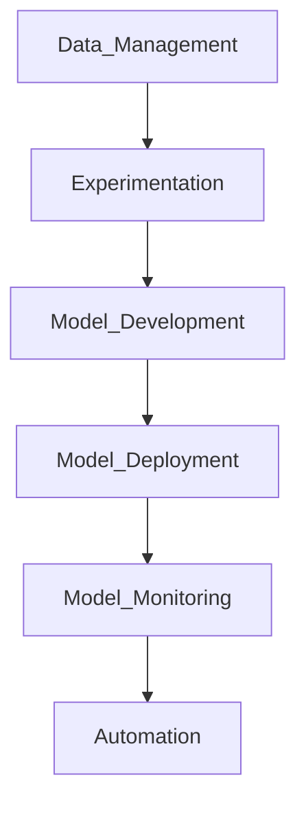

1.  Data Management: Understand the data pipeline, data governance, and data quality.
2.  Experimentation: Learn about experimentation frameworks, version control, and reproducibility.
3.  Model Development: Understand model development life cycle, model training, and tuning.
4.  Model Deployment: Learn about model deployment, A/B testing, and canary releases.
5.  Model Monitoring: Understand how to monitor models in production, and how to detect and diagnose issues.
6.  Automation: Learn about automation tools, such as Jenkins and Ansible, to automate ML workflows.

