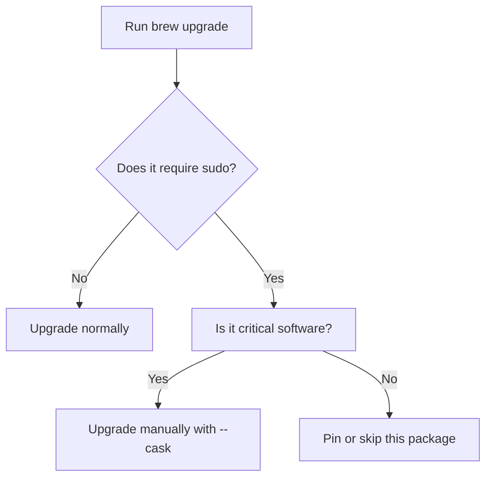

## Understanding the Problem

Homebrew is designed to install software without root privileges. Most formulae live peacefully under `/usr/local` or `/opt/homebrew`, updating silently. Yet sometimes you hit an upgrade that stops mid-flow asking for your password. This happens when the formula is actually a **cask** that installs via a macOS `.pkg` file. Those installers, like `dotnet-sdk`, Java, or Docker, need admin rights to write under `/Library`.

Running `brew update && brew upgrade` in automation, or even during a morning maintenance routine, becomes painful if one package demands manual confirmation.

```bash
==> Upgrading dotnet-sdk
==> Uninstalling packages with `sudo` (which may request your password)...
Password:
````

The challenge is: how to let Homebrew upgrade everything else _except_ those sudo-needy packages?

## How Homebrew Handles Upgrades

The key to understanding this lies in the distinction between **formulae** and **casks**.

- **Formulae** are built from source or precompiled binaries and install locally.
    
- **Casks** wrap macOS installers (`.pkg` or `.dmg`), often using `sudo` under the hood.
    

```bash
# Upgrade only normal formulae
brew upgrade --formula

# Upgrade casks (usually the ones needing sudo)
brew upgrade --cask
```

By splitting upgrades this way, you can run the formula upgrades safely and delay the cask upgrades for when you’re ready to enter a password.


## Useful Patterns for Controlling Upgrades

There are a few practical patterns that help you avoid password prompts without breaking your update flow.

### 1. Pin the problem packages

Pinning prevents a package from being upgraded or cleaned up. It’s ideal when you want to hold off on upgrades that are known to require admin privileges.

```bash
brew pin dotnet-sdk
```

You can unpin later with:

```bash
brew unpin dotnet-sdk
```

Pinned packages are skipped automatically by both `brew upgrade` and `brew cleanup`.

### 2. Skip casks entirely

If your upgrade script doesn’t need GUI tools or frameworks, this is the simplest fix:

```bash
brew upgrade --formula && brew cleanup
```

No sudo prompts, no surprises.

### 3. Filter out known offenders dynamically

If you want a more flexible approach, you can automate selective upgrading with a simple shell loop:

```bash
for pkg in $(brew outdated --quiet); do
  if brew reinstall "$pkg" --dry-run 2>&1 | grep -q "sudo"; then
    echo "Skipping $pkg (requires sudo)"
  else
    brew upgrade "$pkg"
  fi
done
```

This simulates each upgrade first. Anything that would invoke `sudo` is skipped.


## When to Use These Approaches

### When It Makes Sense

- You’re automating Homebrew upgrades in a CI job, scheduled task, or startup script.
- You’re on a work laptop where you don’t have admin rights.
- You want to keep your local developer tools up to date but prefer to manually review framework-level changes like .NET or Java.

### When Not to Use

- You manage system-wide development environments and actually _need_ the latest frameworks for compatibility.
- You rely on the full cask ecosystem (e.g., GUI apps) and are okay with interactive upgrades.

## Things to Watch Out For

Skipping casks means you may fall behind on security updates for those apps. If you pin something, remember to unpin periodically and check whether a new version resolves past issues.

Also, not every `.pkg` installer actually uses `sudo` every time—it depends on how the vendor packaged it. Sometimes a version update switches from a simple binary to a `.pkg`, suddenly introducing password prompts. You’ll notice it quickly because your upgrade automation will hang.

Here’s a mental model to decide:



The trick is to control the boundary between convenience and responsibility. Homebrew gives you the tools—`--formula`, `--cask`, and `pin`—but expects you to use them deliberately.

## The Fine Print

There’s no hidden flag like `--ignore-sudo` in Homebrew’s command set. You have to rely on composition: limiting the upgrade scope and pinning selectively. The nice part is that all of this integrates cleanly with your daily maintenance habits.

A typical non-interactive safe sequence on macOS might look like this:

```bash
brew update
brew upgrade --formula
brew cleanup
```

Then, once a week or month, handle casks manually:

```bash
brew upgrade --cask
```

This rhythm keeps your CLI tools fresh while letting you decide when to deal with packages that need elevated rights. It’s a small adjustment that turns Homebrew into a far smoother experience on macOS.