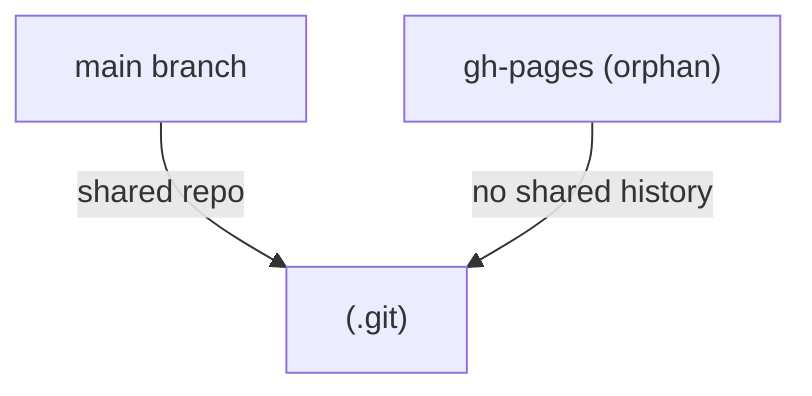

## Understanding orphan branches in Git

There’s a lesser-known Git feature that allows you to start a branch with no history at all:  
`git checkout --orphan <branch>`.  
It creates a new branch **disconnected** from any commits or files that exist in the current branch.

Think of it as a fresh repository living inside your repo — same `.git` database, different history.  
Everything from your current branch remains in your working directory, but the new branch starts with no commits.  
You can then decide which files to keep, stage them, and make an initial commit that becomes the root of this branch.

```bash
# Create a new orphan branch named 'gh-pages'
git checkout --orphan gh-pages

# Clean out files from the working directory
git rm -rf .

# Add whatever you want to keep in this branch (e.g. built docs, reports)
echo "Performance results" > index.html
git add index.html
git commit -m "Initial gh-pages commit"
````

At this point, you’ve got a brand new branch — no link to your project’s main history.  
It’s perfect for things you don’t want tangled with your codebase: generated reports, documentation, benchmarks, or built assets.



Unlike a normal branch, an orphan branch doesn’t have a parent commit, so merges or rebases to it don’t make sense — it’s meant to live independently.

## Using it with GitHub Actions

Let’s say you run automated performance tests in your CI pipeline and want to **publish their results** to a separate branch (`gh-pages`) — so you can host them via GitHub Pages or just keep them visible.

Here’s the minimal GitHub Actions workflow to make that happen:

```yaml
name: Publish performance results

on:
  workflow_run:
    workflows: ["Run Performance Tests"]
    types:
      - completed

jobs:
  publish:
    runs-on: ubuntu-latest
    steps:
      - name: Checkout main branch
        uses: actions/checkout@v4
        with:
          fetch-depth: 0  # we’ll need the full history to create new branch

      - name: Generate performance report
        run: |
          mkdir -p reports
          echo "Lighthouse results here..." > reports/index.html

      - name: Commit results to gh-pages
        run: |
          git checkout --orphan gh-pages
          git rm -rf .
          cp -r reports/* .
          git add .
          git -c user.name='github-actions' -c user.email='actions@github.com' commit -m "Update performance results"
          git push --force origin gh-pages
```

The important detail:  
`git checkout --orphan gh-pages` creates a clean branch inside the same repo,  
and `git push --force origin gh-pages` overwrites the branch each time, keeping only the latest reports.

You could later enable **GitHub Pages** to serve that branch, and your performance dashboard would live at  
`https://<username>.github.io/<repo>/`.


## When this pattern makes sense

This approach shines when you want to:

- Publish generated files (reports, docs, dashboards) without polluting your main branch.
    
- Keep automation output under version control but separated from your code.
    
- Host static files directly from the repository with GitHub Pages.
    

It’s less suited when:

- You need historical diffs between runs — the `--force` push wipes history.
    
- Reports are huge — pushing megabytes of HTML or JSON repeatedly is slow.
    
- The repo is private and GitHub Pages isn’t enabled — you might prefer an artifact store or S3.
    

For long-term tracking, you might instead append results to a dedicated folder in the main branch or store them in a database.

## Subtle details and common pitfalls

A few things can bite you when using orphan branches from automation:

1. **Forgetting to clean up.**  
    After `git checkout --orphan`, your working directory still has files from the previous branch.  
    If you forget `git rm -rf .`, those files will get re-committed.
    
2. **Forcing overwrites.**  
    Each run should do a clean commit and a `--force` push. Without that, you may get “non-fast-forward” errors because the branch histories are unrelated.
    
3. **Detached history.**  
    You can’t merge or diff easily between `gh-pages` and `main`. This is by design, but it means you can’t `git diff main...gh-pages`.
    
4. **Keeping GitHub Pages clean.**  
    If you only need artifacts for internal review, consider naming the branch `reports` or `artifacts` instead of using `gh-pages`.
    

Here’s what _not_ to do:

```bash
# Wrong: this will mix commits from main
git checkout -b gh-pages  # Bad, keeps full history

# Correct
git checkout --orphan gh-pages
```

Orphan branches are like disposable notebooks: use them for output, not for code - and they’ll serve you well.