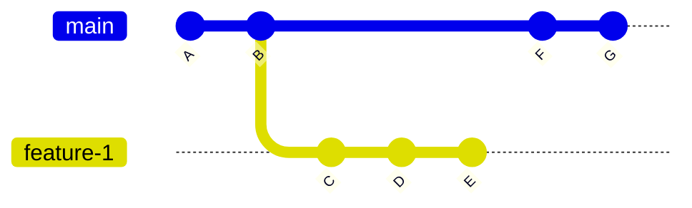

up::[[MOC_Software_Development]]
up::[[MOC_Git]]

## Introduction

In this guide, we will learn how to create a new branch in a Git repository based on a previous commit. We have commit history as below.

<!--

-->
We are not happy with the changes C, D and E. We would like to start again from B, but we want to keep changes C, D and E in a new branch. Specifically, we will create a new branch starting from commit B in the main branch. We'll move the subsequent commits C, D, and E to the new branch and continue working on the main branch from the state of commit B - new commits F and G.

<!--

-->

This guide assumes you have a basic understanding of Git commands and are familiar with the command line interface.

## Step-by-Step Guide

### Determine the current branch and commit

   Open the terminal and navigate to the Git repository where you want to perform this operation. Use the following command to display the current branch and commit:

```sh
git status
```

### Create a new branch from commit B

   To create a new branch at commit B, use the following command:

```sh
git branch new-branch-name commit-B-hash
```

   Replace `new-branch-name` with the desired name for your new branch and `commit-B-hash` with the hash or unique identifier of commit B. This command creates a new branch without switching to it.

### Move commits C, D, and E to the new branch

   Switch to the new branch using the following command:

```sh
git checkout new-branch-name
```

   This command switches your working directory to the new branch. Commits C, D, and E will be moved to this branch while leaving the main branch unaffected.

   To move commits C, D, and E to the new branch, use the interactive rebase command:

```sh
git rebase -i commit-B-hash
```

   Replace `commit-B-hash` with the hash or unique identifier of commit B. An interactive rebase will open, displaying a list of commits.

### Rearrange the commits in the interactive rebase

   In the interactive rebase interface, locate the lines representing commits C, D, and E. Rearrange their order by moving them above commit B. Save and close the file to continue.

### Update the main branch

   Switch back to the main branch using the following command:

```sh
git checkout main
```

   Your working directory will now be on the main branch.

### Make changes to the main branch based on commit B

   You are now on the main branch, as it was at commit B. Make the necessary changes or improvements.

### Commit the changes on the main branch

   Stage your changes using the following command:

```sh
git add .
```

   Commit the changes with a descriptive message using the following command:

```sh
git commit -m "Describe your changes or improvements"
```

### Continue development on the main branch

   At this point, you can continue making new commits on the main branch, just as you would in any normal development workflow.

> **NOTE**: perhaps it is not a best practice to run development on the main branch - you can learn more about it from various branching strategies. We use such a schema here for sake of simplicity.

## Conclusion

Congratulations! You have successfully created a new branch starting from commit B and moved the subsequent commits C, D, and E to the new branch. The develop branch has been reverted to its state at commit B, allowing you to continue development from that point. Remember to use Git commands with caution and make sure to create backups or push your changes to a remote repository for safety.
