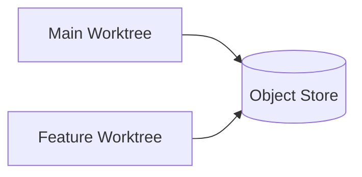
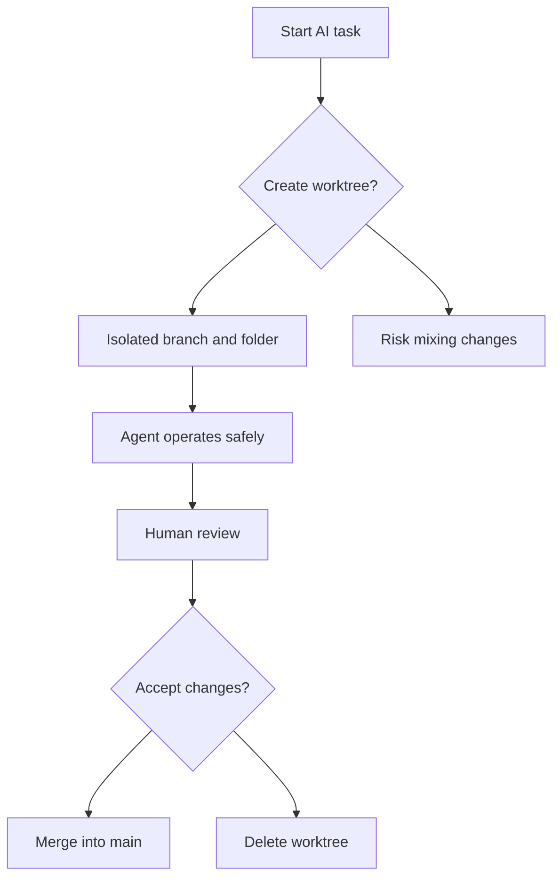

## The Mental Model

Git worktrees let a single repository sprout multiple working directories, each tied to a different branch but sharing the same object store. It feels almost like having parallel realities: one directory on `develop`, another on a feature branch, yet another on a temporary test branch, all living side by side without fighting for checkout state. There is no deep magic behind this; Git simply keeps the `.git` metadata in one place and mounts lightweight directory views that track their own branch heads.

A tiny example explains the idea better than abstraction ever could:

```bash
# Add a new worktree checked out to branch feature/refactor
git worktree add ../refactor-sandbox feature/refactor
````

Your filesystem now holds two siblings:

```
project/
refactor-sandbox/
```

The first stays on your main line of work. The second is a clean, isolated world where an AI agent can generate, rewrite, or destructively refactor code without trampling over your ongoing tasks.

Here is a simplified illustration of how worktrees relate to the underlying object store:



This is the core arrangement: many worktrees, one shared repository brain.

## What You Can Do

The real advantage of worktrees is not in the basic command but in the freedom of running multiple contexts at the same time. This becomes especially useful when coding with agents that expect a clean directory and stable branch state.

You can place an AI agent in a dedicated worktree and let it operate as if it were the only thing happening in the project. Meanwhile, you continue normal development somewhere else, without stashing, switching, or cleaning up.

```bash
# One worktree with your manual changes
project/

# Another dedicated to agent actions
git worktree add ../agent-run ai/experiment
```

The agent gets its own branch and folder, untouched by half-written ideas or files you forgot to commit. When it produces large structural changes, you can evaluate them in isolation and merge only when convinced the proposal makes sense.

You can go further and set up multiple competing proposals:

```bash
git worktree add ../proposal-A ai/proposal-A
git worktree add ../proposal-B ai/proposal-B
```

Agents operate freely. You compare their results with human eyes.

## Practical Scenarios

This workflow shines when you are working with tools that tend to rewrite code rather than patch it. Many agents do this. A worktree acts like a disposable environment.

You might use them when engaging in heavy refactors, upgrades across the whole codebase, or exploratory changes generated by an agent, where the risk of polluting your current branch is high. You can let the agent run tests or static checks inside that environment as well, because nothing touches your main working directory.

There are situations where a worktree is not a good fit. If you are working in a simple repository with a single branch and you rely heavily on ephemeral changes, then switching branches or using commit-based snapshots might be simpler. Also, if an agent expects to operate on a fully isolated clone rather than a shared store, then a real clone is safer. Some poorly implemented tools still assume that `.git` lives inside the working directory; those break in a worktree layout.

A real-world example: you have a large Python codebase. You want an agent to attempt a dependency upgrade across many modules. You create a fresh worktree and branch called `upgrade/fastapi-0.115`. The agent runs its rewrite steps there. You stay focused on a bug fix on `develop`, undisturbed. Later, you review the agent’s output, run tests, and only then merge. The separation reduces mistakes.

## The Fine Print

There are a few subtle behaviors worth knowing before using worktrees as part of your AI-assisted coding workflow. The first is that each worktree tracks its own branch head. If you forget which directory you are in, it is easy to commit to the wrong branch. The fix is simple: always inspect `git status` before committing, especially when moving between folders.

Another nuance is the deletion cycle. Removing a worktree requires both removing the folder and cleaning up Git’s internal registry. If an AI tool aggressively deletes directories, Git can get confused until you run `git worktree prune`.

Performance is usually excellent, since objects are shared, but some agent tools expect the `.git` directory to be physically inside the folder. Worktrees create a `.git` file that points elsewhere. When such tools fail, the workaround is to copy the `.git` directory from the main repo into the worktree. This is safe only for debugging; the correct fix is to use tools that support worktrees properly.

Here is an example of what not to do:

```bash
# Wrong: manually replacing the pointer file
rm agent-run/.git
cp -r project/.git agent-run/.git   # Bad
```

This produces a corrupted setup. The correct approach is to use tools that understand Git’s layout or run them in the primary worktree.

Another detail: worktrees are lightweight but they do not isolate installed dependencies, temporary files, or build artefacts. If your agent modifies environment-level resources, you still need separate virtual environments. Using per-worktree environments avoids cross-contamination:

```bash
python3 -m venv venv
source venv/bin/activate
pip install -r requirements.txt
```

Finally, merging large agent-generated changes becomes easier because diffs are clean and self-contained. The trade-off is that you must resist the temptation to accept everything wholesale. A worktree encourages discipline: treat the agent’s output as a draft, not a command.

```python
# Bad: blindly accepting generated rewrite
def load_user(id):
    return db.get_user(id)  # Lost validation

# Good: incorporate intention, keep safeguards
def load_user(id):
    user = db.get_user(id)
    if user is None:
        raise ValueError("User not found")
    return user
```

Here is the decision flow in a format Mermaid will accept:



## See also:
- [Git - git-worktree Documentation](https://git-scm.com/docs/git-worktree)
- Step-by-step tutorial to practice working with multiple worktrees [[git_worktrees_ai_multi_workflows_tutorial]]