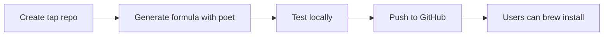

## Overview

Homebrew distribution lets users install your Python CLI with `brew install your-tool`. The process: create a GitHub "tap" repository, generate a Ruby formula file, test it, and publish.

## Prerequisites

Your package must be on PyPI with an `sdist` (source distribution), not just wheels. All dependencies need `sdist` too. Define entry points in `pyproject.toml`:

```toml
[project.scripts]
your-cli-tool = "your_package.cli:main"
```

## Step-by-Step Process

**1. Create a tap repository.** A Homebrew tap is just a GitHub repository with a specific naming convention. Create a repo named `homebrew-{something}` under your account. When someone runs `brew tap yourusername/something`, Homebrew looks for `github.com/yourusername/homebrew-something`.

```bash
# Users will install your tool like this:
brew tap yourusername/tools
brew install your-cli-tool

# Or in one command using the full path:
brew install yourusername/tools/your-cli-tool
```

Inside your tap repository, create a `Formula` directory for your Ruby `.rb` formula files. See [How to Create and Maintain a Tap](https://docs.brew.sh/How-to-Create-and-Maintain-a-Tap).

**2. Generate the formula** using [homebrew-pypi-poet](https://github.com/tdsmith/homebrew-pypi-poet) in a fresh venv:

```bash
cd /tmp && python -m venv venv && source venv/bin/activate
pip install your-cli-tool homebrew-pypi-poet
poet -f your-cli-tool > your-cli-tool.rb
```

**3. Test locally** before pushing:

```bash
HOMEBREW_NO_INSTALL_FROM_API=1 brew install --build-from-source --verbose --debug ./your-cli-tool.rb
```

**4. Push to GitHub.** Users install via `brew install yourusername/tapname/your-cli-tool`.



## Common Pitfalls

- **Missing sdist** - Package or dependency lacks source distribution on PyPI
- **Contaminated poet env** - Always use a fresh venv for formula generation
- **No license** - Required for homebrew-core submission

## Going Further

For homebrew-core submission (pre-compiled bottles, `brew search` discoverability), see [homebrew-core CONTRIBUTING](https://github.com/Homebrew/homebrew-core/blob/master/CONTRIBUTING.md). For automated updates, see [GitHub Actions automation](https://til.simonwillison.net/homebrew/auto-formulas-github-actions).

## Sources and Further Reading

- [Packaging a Python CLI tool for Homebrew](https://til.simonwillison.net/homebrew/packaging-python-cli-for-homebrew) - Simon Willison's comprehensive walkthrough
- [Python for Formula Authors](https://docs.brew.sh/Python-for-Formula-Authors) - Official Homebrew Python documentation
- [Formula Cookbook](https://docs.brew.sh/Formula-Cookbook) - Writing and testing formulas
- [homebrew-pypi-poet](https://github.com/tdsmith/homebrew-pypi-poet) - Formula generation tool
