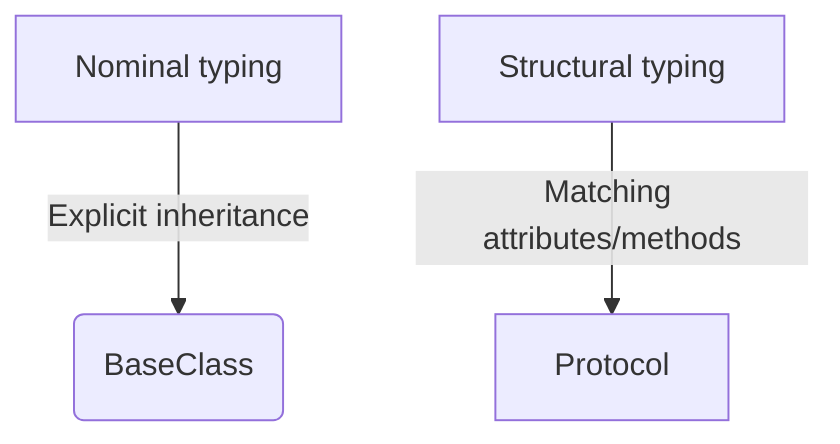

## The Basic Idea

Introduced in **Python 3.8** via **[PEP 544](https://peps.python.org/pep-0544/)**, *Protocols* extend Python’s static typing system by allowing **structural subtyping** — also called *static duck typing*.  
It means that instead of checking *what a class inherits from*, Python type checkers can verify *what methods and attributes* it provides.

Let’s unpack this idea with a simple example.

```python
from typing import Protocol

# Define a protocol describing the "shape" of a writer
class Writer(Protocol):
    def write(self, text: str) -> None:
        ...

# Any class implementing 'write' will satisfy this protocol
class FileWriter:
    def write(self, text: str) -> None:
        print(f"Writing to file: {text}")

class ConsoleLogger:
    def write(self, text: str) -> None:
        print(f"LOG: {text}")

def log_message(writer: Writer, msg: str) -> None:
    writer.write(msg)

log_message(ConsoleLogger(), "Hello")  # OK
log_message(FileWriter(), "Hello")     # OK
````

Neither `FileWriter` nor `ConsoleLogger` inherit from `Writer`.  
But both _structurally match_ it — they have a `write` method with the same signature.  
This is the essence of protocols: **“If it quacks like a duck, type checkers treat it as a duck.”**

## Useful Patterns

Protocols aren’t just about pretending to be an interface. They unlock new expressive power for static type hints and help keep your code decoupled. Let’s explore some common variations.

### Read-only Attributes

You can describe expected attributes directly in a protocol.

```python
class HasName(Protocol):
    name: str

def greet(entity: HasName) -> None:
    print(f"Hello, {entity.name}!")

class User:
    def __init__(self, name: str) -> None:
        self.name = name

greet(User("Alice"))  # OK
```

Here, any object with a `name` attribute of type `str` will pass the type check.

### Optional and Partial Protocols

Sometimes you don’t need to specify all possible methods — only those relevant to your function.

```python
class SupportsClose(Protocol):
    def close(self) -> None:
        ...

def safe_close(resource: SupportsClose) -> None:
    try:
        resource.close()
    except Exception:
        pass
```

This works beautifully with many built-in classes (`io.TextIOWrapper`, sockets, etc.).

### Runtime Checkable Protocols

By default, `isinstance()` and `issubclass()` don’t work with protocols.  
You can enable that explicitly using `@runtime_checkable`.

```python
from typing import runtime_checkable

@runtime_checkable
class Runnable(Protocol):
    def run(self) -> None:
        ...

class Worker:
    def run(self) -> None:
        print("Working...")

print(isinstance(Worker(), Runnable))  # True
```

Be cautious, though — runtime checking only verifies that a class _explicitly_ implements the methods (not dynamically added ones).

## Where It Shines

Protocols shine in situations where **you want flexibility without inheritance** — particularly in large systems or when using third-party libraries.

### When to Use

- When you want to specify _expected behavior_ without forcing inheritance.
- When integrating code from multiple libraries that weren’t designed to work together.
- When designing APIs that rely on capabilities (“things that can write”, “things that can close”, etc.) rather than hierarchies.


### When Not to Use

- When you actually need **shared implementation** (then a base class is better).
- When your codebase doesn’t use static type checking tools like **mypy**, **pyright**, or **pylance** — the benefits won’t materialize at runtime.
- When the protocol would describe a highly dynamic or runtime-altered interface.

### Example: Logging Abstraction

Let’s look at a practical scenario. Suppose you have a service that writes logs, but you want to support multiple backends.

```python
class LogHandler(Protocol):
    def write(self, msg: str) -> None:
        ...
    def flush(self) -> None:
        ...

def process_data(handler: LogHandler) -> None:
    handler.write("Start processing...")
    # do work
    handler.flush()

# Works with both
process_data(ConsoleLogger())
process_data(FileWriter())
```

You’ve decoupled your code from concrete classes — that’s clean design.

## The Fine Print

Protocols are deceptively simple but have a few subtleties worth knowing.

### Structural vs Nominal Subtyping

Traditional inheritance in Python is **nominal**: types are related by declared lineage.  
Protocols enable **structural subtyping**: types are compatible based on structure.

The diagram below shows the conceptual difference.



### Generic Protocols

You can make protocols generic to express relationships between types.

```python
from typing import TypeVar, Protocol

T = TypeVar("T")

class SupportsLessThan(Protocol[T]):
    def __lt__(self, other: T) -> bool:
        ...
```

### Common Mistakes

```python
class BadLogger:
    def write(self, msg):  # Wrong - missing type annotation
        print(msg)

def log_data(writer: Writer):
    writer.write("message")

# mypy will complain: BadLogger.write() type doesn't match Writer.write()
```

Always match both **method name** and **signature** exactly — including annotations.  
Otherwise, the type checker will reject the class.

### Performance and Design Notes

Protocols exist only for _type checking_; at runtime, they add virtually no overhead.  
They don’t enforce behavior — they just describe it.  
That’s a strength, but also a risk: they can give a false sense of safety if your codebase doesn’t use static analysis.

> **HINT**: In real projects, protocols often replace ad-hoc duck typing checks like `hasattr(obj, "write")` with explicit, type-checked contracts — a major readability and safety win. You can check your code base whether you have intensive usage of `hasattr`

## Closing Thought

Protocols bring static typing and duck typing together in a surprisingly elegant way.  
They don’t replace inheritance or abstract base classes — they **complement** them.  
Where ABCs define _what must be implemented_, protocols describe _what is already provided_.

## References
- longer, bottom-up introduction to Protocols: [Python Protocols: Leveraging Structural Subtyping – Real Python](https://realpython.com/python-protocol/)
- 