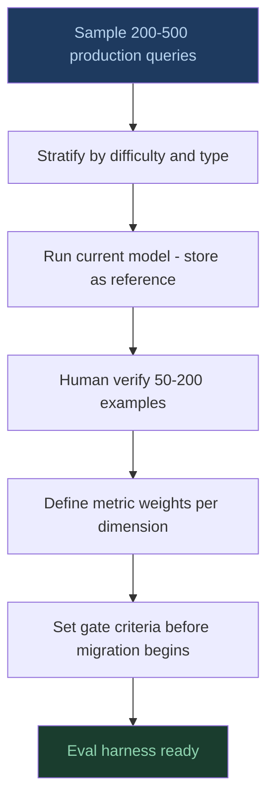
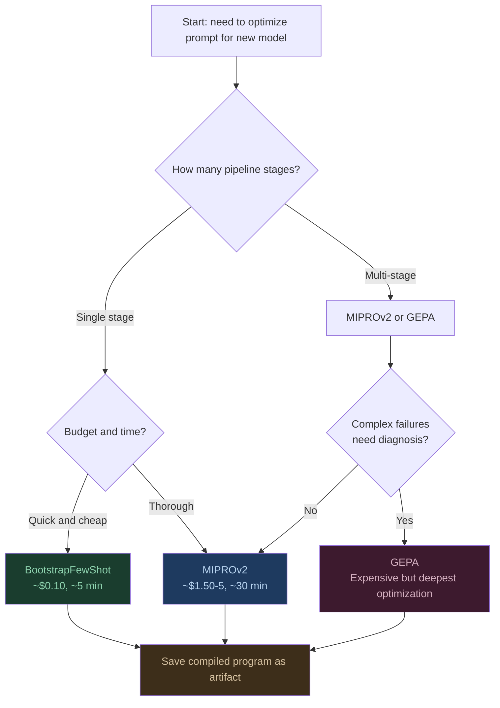
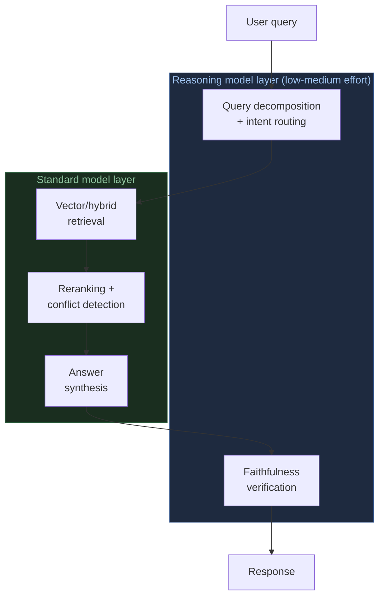
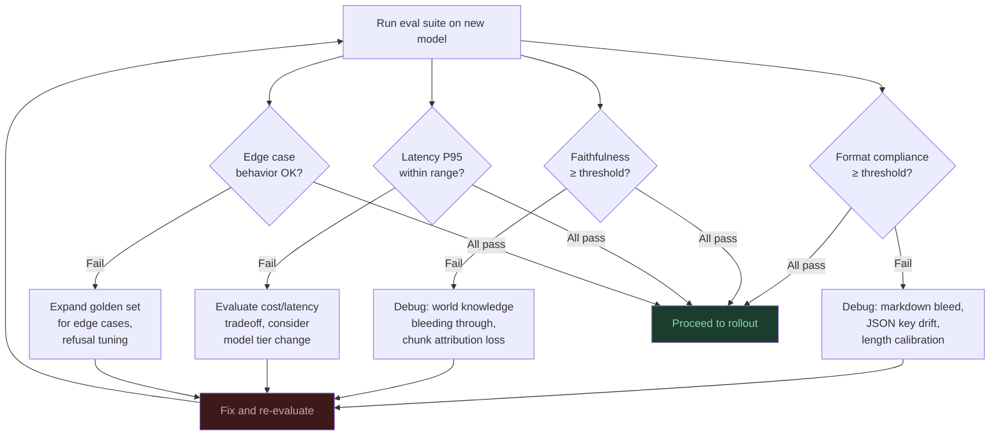
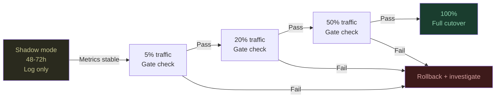

So OpenAI deprecated `gpt-4o-mini`. Or some other model you've built your whole system around just got a sunset date. The email lands and your first thought is: *how hard can a model swap be?*

I've been through this a few times now. The API call swap? Easy. Twenty minutes, tops. But the swap has a way of revealing every shortcut and assumption your system has been quietly depending on. That's the part people don't usually mention until you're already in it.


## Table of contents

1. [What migration actually is](#what-migration-actually-is)
2. [The model options in 2026](#the-model-options-in-2026)
3. [Phase 0 - Know what you're migrating from](#phase-0--know-what-youre-migrating-from)
4. [Phase 1 - Build your evaluation harness first](#phase-1--build-your-evaluation-harness-first)
5. [Phase 2 - The prompt portability problem](#phase-2--the-prompt-portability-problem)
6. [Phase 3 - Automated prompt optimization with DSPy](#phase-3--automated-prompt-optimization-with-dspy)
7. [Phase 4 - Reasoning models: where they belong](#phase-4--reasoning-models-where-they-belong)
8. [Phase 5 - Handling missing parameters](#phase-5--handling-missing-parameters)
9. [Phase 6 - Risk assessment](#phase-6--risk-assessment)
10. [Phase 7 - Progressive rollout](#phase-7--progressive-rollout)
11. [Phase 8 - Post-migration monitoring](#phase-8--post-migration-monitoring)
12. [The systems audit you should run regardless](#the-systems-audit-you-should-run-regardless)


## What migration actually is

Here's the (uncomfortable) truth: a model migration is really a systems audit. It just happens to come with a deadline someone else set for you.

When you swap the model under a RAG pipeline, you're removing the environment your system's behavior was calibrated in. And you get to find out how much of that behavior was intentional versus... just kind of happened over time.

Three things consistently surface during migration that were invisible before:

**Quality often wasn't measured.** A lot of production LLM systems have never been formally evaluated. No golden dataset, no faithfulness score, no format compliance check. "Quality" is whatever the team last looked at and didn't complain about. You can't claim "no quality loss" if you never measured quality to begin with.

**Your prompt is coupled to the old model.** That system prompt you spent weeks on? It's not a specification. It's a negotiation artifact, the residue of back-and-forth between your intentions and one specific model's quirks. Swap the model and you haven't ported a prompt. You've orphaned it. (This one hurts. More in [Phase 2](#phase-2--the-prompt-portability-problem).)

**Model behavior often isn't versioned.** Pinning a model name isn't the same as pinning model behavior. OpenAI updates weights behind dated aliases without telling you. If you're using `gpt-4o-mini` as a floating pointer, you may have already had a silent behavioral change in production. If your observability didn't catch it... well, that tells you something about your observability.

The teams who migrate cleanly aren't the ones with the best migration plans. They're the ones who treated their LLM system like a real production system long before a deadline showed up.


## The model options in 2026

*Note: While this article uses OpenAI models as examples, the migration patterns, evaluation strategies, and architectural decisions apply to any LLM provider. The same principles work whether you're migrating between Anthropic's Claude models, open-source models, or any other provider.*

Before you plan anything, you need to know what you're migrating *to*. OpenAI's current model family has two very different architectures, and picking the wrong one can create more problems than the deprecation itself.

### Standard instruction models

[GPT-5.4](https://platform.openai.com/docs/models/gpt-5.4), [GPT-5.4-mini](https://platform.openai.com/docs/models/gpt-5.4-mini), and [GPT-5.4-nano](https://platform.openai.com/docs/models/gpt-5.4-nano) are the current flagship models. They support variable `reasoning_effort` (none/low/medium/high/xhigh), plus all the standard parameters: `temperature`, system prompts, JSON mode, function calling, streaming. For most RAG answer generation workloads, one of these is where you should land.

**Recommended default for gpt-4o-mini replacement: `gpt-5.4-nano`** -comparable cost tier ($0.20 per million input tokens vs $0.10 for gpt-4o-mini), significantly more capable, fully API-compatible. If you need the extra capability and can handle the cost, `gpt-5.4-mini` ($0.75/MTok input) is a strong middle option.

### Pure reasoning models

The [o-series models](https://openai.com/index/introducing-o3-and-o4-mini/) (o3, o4-mini) are pure reasoning models without the hybrid flexibility of GPT-5.x. They *only* do reasoning, don't support `temperature` or standard sampling parameters, and use `reasoning_effort` as the sole control. These are specialists.

Here's what most people get wrong: for typical RAG pipelines, pure reasoning models aren't better answer generators. They're decision infrastructure. I'll get into exactly where they earn their cost in [Phase 4](#phase-4--reasoning-models-where-they-belong).

```
Model selection decision tree:

Is the answer synthesis step genuinely multi-hop?
(A implies B, B contradicts C, therefore...)
  └── No  → Standard model (gpt-5.4-nano or gpt-5.4-mini)
  └── Yes → Is it high-stakes with real consequences?
              └── No  → Standard model with reasoning_effort: low/medium
              └── Yes → Consider pure reasoning model (o3, o4-mini)
                        OR standard model with reasoning_effort: high
                        for verification layer over synthesis
```


## Phase 0 -Know what you're migrating from

I know, I know. You want to start swapping things. But before you write a line of migration code, document what your system actually does right now. Otherwise you'll have no way to tell if the migration worked or just seemed like it did.

### Inventory your integration surface

Pull every place in your codebase where the model name appears. This includes:

- Direct API calls with `model=` parameter
- Configuration files and environment variables
- Any SDK initialization that sets a default model
- Evaluation scripts that may be pinned to the old model for judging

For each integration point, record: the model name, the prompt template used, the parameters passed (`temperature`, `max_tokens`, etc.), and the expected output format.

### Document implicit behavioral assumptions

This part's harder because these things rarely get written down. You need to look for anywhere your code processes model outputs and makes assumptions about what they look like:

- JSON parsing of model responses (field names, nesting depth)
- Regex or string matching on output format
- Length-based truncation or display logic
- Citation extraction that assumes a specific citation format
- Any code that branches on output content

Each of these is a behavioral assumption about your current model. And each assumption is a place where things can quietly break.

### Get a pre-migration quality snapshot

Run your current system against a sample of real production queries and save the outputs. This is your before-state. Even if you don't have a formal eval harness yet, just having the raw outputs lets you compare later. Future-you will be grateful.


## Phase 1 - Build your evaluation harness first

I can't stress this enough. Everything else you do, prompt changes, model selection, rollout strategy, is going to be guided by what your evals tell you. Skip this and you'll discover regressions in production. I've watched teams do this. The cost of fixing things at that point is genuinely 10x higher.

### Build a golden dataset

Sample 200–500 real queries from production logs. For each, store:

- The original query
- The retrieved context chunks
- The current model's answer (this becomes your reference)
- For as many as you can afford: a human-verified "ideal" answer

> Notice: with this approach you are preparing for testing answer generation part of the RAG not the retriever.

**Don't sample uniformly.** Stratify on purpose. Include:

| Stratum | Why |
|---|---|
| Easy factual queries | Regression canary, should never fail |
| Multi-chunk synthesis | Where model capability actually matters |
| Conflicting context | Tests faithfulness under pressure |
| Out-of-scope queries | Refusal behavior regression |
| Edge cases your team knows about | The ones that broke things before |

Aim for at least 50 human-verified examples. 200 is significantly better.

### What to evaluate

For a RAG system, here's what you actually need to measure:

**Faithfulness** - does the answer only claim things supported by the retrieved context? This is the big one. A model that hallucinates confidently is scarier than one that refuses to answer. Use the [Ragas faithfulness metric](https://docs.ragas.io/en/latest/concepts/metrics/faithfulness.html).

**Answer relevance** - does it answer what was actually asked? ([Ragas answer relevance](https://docs.ragas.io/en/latest/concepts/metrics/answer_relevance.html))

**Format compliance** - does the output match your schema? JSON structure, citation format, length constraints. You'll likely need a custom LLM-as-judge metric here because format requirements vary widely.

**Refusal accuracy** - when the context doesn't contain the answer, does the model say "I don't know" instead of making something up?

**Groundedness** - can you trace specific claims back to specific chunks? Similar to faithfulness but more granular.

### Evaluation tooling

[Ragas](https://docs.ragas.io/) automates faithfulness, answer relevance, context precision, and context recall scoring using an LLM-as-judge approach. Point it at your golden dataset and run both old and new model outputs through it to get comparable scores.

[PromptFoo](https://www.promptfoo.dev/) works well for regression testing during prompt iteration. Define test cases with expected outputs or assertions and run them against multiple models simultaneously, which is exactly the side-by-side comparison you need during migration.

[LangSmith](https://smith.langchain.com/) or [Braintrust](https://www.braintrust.dev/) if you want persistent experiment tracking. They store eval runs with scores, let you diff outputs visually, and can alert on regressions. Worth setting up if this migration will take more than a week.

[MLflow](https://mlflow.org/docs/latest/genai/tracing/) for teams already in the MLflow ecosystem. It has native LLM tracking and integrates directly with DSPy (covered in Phase 3).

### Define pass/fail gate criteria

Do this *before* running any evals. Seriously. If you define criteria after seeing results, you'll unconsciously anchor them to whatever the new model happens to achieve. Human brains are terrible at this.

Example gate criteria:
- Faithfulness score ≥ 0.92
- Format compliance ≥ 0.98
- Answer relevance ≥ 0.90
- P95 latency within 20% of baseline
- Refusal accuracy ≥ 0.95 on out-of-scope stratum




## Phase 2 - The prompt portability problem

Okay, this is the part that causes the most pain, and people don't usually talk about it honestly.

### Written prompts vs tuned prompts

There's a difference between a prompt that *specifies* behavior and a prompt that was *tweaked until outputs stopped looking weird*. It's a bigger difference than you'd think.

**A written prompt** starts from a behavioral spec. You know what the system must do, what it must not do, what the output format looks like. The constraints are verifiable regardless of which model you're running:

```
- Answer using only information present in the provided context chunks.
- If the context does not contain sufficient information, respond with 
  exactly: "I cannot answer this from the available information."
- Format citations as [source_id] inline, immediately after the claim 
  they support.
```

These survive a model swap. You can read the prompt and tell whether any output satisfies them, regardless of which model made it.

**A tuned prompt** is what most of us actually have. It starts from a vague goal and grows through patches. You wrote a first draft. Outputs were mostly fine but the model kept adding chatty preambles, so you added "be concise." Then it started truncating, so you added "be thorough but concise." Citations were inconsistent, so you added "always cite sources." Then it started over-citing, so you added "cite only when directly referencing a specific fact."

Sound familiar? Six months later your prompt is 800 words and full of stuff like:

- *"Do not add unnecessary preambles"* - patch for a greeting behavior specific to an old model weight
- *"Avoid repeating the question in your answer"* - patch for a retriggering behavior
- *"Use natural language, not bullet points unless the question explicitly asks for a list"* - patch for a formatting regression after a silent weight update

None of these describe what your system is *supposed* to do. They're band-aids for specific past failures of a model that no longer exists.

### Why tuned prompts are so common

If you're feeling called out right now, don't. The vast majority of production RAG prompts are more tuned than written.

**Patching is faster than specifying.** When you're iterating on a RAG system, you see problems and fix them. The fastest fix is usually adding an instruction. Writing a proper spec requires knowing all failure modes before you've seen them, which is... impossible when failures emerge from interaction with real data.

**Nothing forces you to notice until migration.** A tuned prompt works. It produces acceptable outputs on the current model. The coupling only becomes visible when you remove the thing it's coupled to.

**Many teams never wrote a spec to begin with.** Writing a specification for "correct behavior" before building the system requires a level of foresight that's genuinely hard to have. So the prompt *became* the spec over time, simultaneously the behavioral specification and the accumulated technical debt. Good luck telling them apart from the inside.

### What to do about it

**Start with prompt archaeology.** Before you touch anything, go through every instruction in your current prompt and label it as either:
- `SPEC` - this describes intended behavior, survives model changes
- `PATCH` - this suppresses a specific failure, may not be relevant to new model

In my experience, most 500+ word prompts end up being about 40% spec and 60% patch. The patches are candidates for removal or replacement after you test compatibility with the new model.

**Run a compatibility baseline before touching anything.** Take your existing prompt verbatim, swap only the model name, run your golden dataset through it, and score with Ragas. This tells you how much of the prompt is still needed versus how much is suppressing behaviors the new model doesn't even have.

**Reconstruct minimally.** Where scores dropped, investigate the failure patterns before changing the prompt. Don't just start adding instructions (that's how you got here). Common adaptation points:

| Issue | Diagnosis | Fix |
|---|---|---|
| Markdown in plain-text outputs | New model has higher markdown affinity | Explicit format instruction |
| Longer responses than expected | Different default length calibration | Token budget instruction + few-shot |
| Citation format drift | Model interprets citation spec differently | Few-shot examples, not more words |
| Refusal behavior change | Different threshold for "insufficient context" | Explicit refusal instruction with example |
| JSON key naming change | Model paraphrases key names | Strict schema in system prompt or JSON mode |

**Few-shot examples are the most reliable format anchor.** More reliable than additional instructions. They act as a behavioral anchor that survives prompt wording differences across model versions. For format-critical RAG outputs, 2-3 few-shot examples will do more work than three paragraphs of format instructions.


## Phase 3 - Automated prompt optimization with DSPy

So manual prompt iteration is what got you into the tuned-prompt mess. [DSPy](https://dspy.ai/) offers a way out: it learns the optimal prompt for your specific data and target model automatically, guided by whatever metric you care about.

### What DSPy actually does

[DSPy](https://github.com/stanfordnlp/dspy) separates the *interface* (what should the model do) from the *implementation* (how do you tell it). You define Signatures (declarative input/output specs) and DSPy optimizers figure out the instructions and examples that best satisfy your metric on your data.

Why this matters for migration: **the prompt that worked on gpt-4o-mini isn't guaranteed to be optimal for gpt-5.4-nano**. DSPy relearns the prompt for the new model automatically. You get model-specific optimization without the manual iteration that created the problem in the first place.

### Translating your pipeline into DSPy

Your answer generation step becomes a Signature:

```python
import dspy

class RAGAnswer(dspy.Signature):
    """Answer the question using only the provided context chunks.
    Cite sources using [chunk_id] notation."""
    
    context: str = dspy.InputField(desc="retrieved context chunks with IDs")
    question: str = dspy.InputField()
    answer: str = dspy.OutputField(desc="faithful, cited answer")

class RAGPipeline(dspy.Module):
    def __init__(self):
        self.respond = dspy.ChainOfThought(RAGAnswer)
    
    def forward(self, context, question):
        return self.respond(context=context, question=question)
```

Switching the target model is one line. Your golden dataset and metric stay identical:

```python
# Before: gpt-4o-mini
dspy.configure(lm=dspy.LM("openai/gpt-4o-mini"))

# After: gpt-5.4-nano - golden dataset unchanged, metric unchanged
dspy.configure(lm=dspy.LM("openai/gpt-5.4-nano"))
```

### Choosing an optimizer



**[BootstrapFewShot](https://dspy.ai/api/optimizers/BootstrapFewShot/)** - the baseline. Generates complete demonstrations for each stage of your program, keeping only those that pass your metric. Use this first. Cheap, fast, often sufficient for single-stage answer generation migration.

**[MIPROv2](https://dspy.ai/api/optimizers/MIPROv2/)** - the workhorse. Runs three stages: bootstrapping to collect high-scoring traces, grounded proposal to draft potential instructions, then discrete search to evaluate instruction-example combinations. Costs ~$1.50-5 at medium auto setting, takes 20-40 minutes. Worth running before any production rollout.

```python
from dspy.teleprompt import MIPROv2

optimizer = MIPROv2(
    metric=your_faithfulness_metric,
    auto="medium",           # light / medium / heavy
    num_threads=8
)

compiled_rag = optimizer.compile(
    RAGPipeline(),
    trainset=train_examples,  # 20% of golden dataset
    valset=val_examples        # 80% of golden dataset
)

# Save as versioned artifact
compiled_rag.save("rag_pipeline_gpt54nano_v1.json")
```

**[GEPA](https://dspy.ai/api/optimizers/GEPA/overview/)** - the newest. Rather than optimizing only the globally best candidate (which leads to local optima), GEPA maintains a Pareto frontier: candidates that achieve the highest score on at least one evaluation instance. It uses a Teacher model to analyze failures and propose targeted fixes. Use for multi-stage pipelines where interaction effects between stages matter. Requires a strong reflection model (`gpt-5.4` or higher recommended).

### The data split that matters

This one's counterintuitive: **20% training, 80% validation**. Yes, reversed from what you're used to. Prompt-based optimizers overfit to small training sets way more aggressively than neural networks. A prompt optimized on 60 examples and validated on 240 will generalize far better than the other way around.

You can get real value from as few as 30 training examples. The validation set is where quality is actually measured.

### DSPy in migration: tool vs framework

Teams adopt DSPy as a permanent architectural layer when the problem only needed a one-time tool.

**Use DSPy as a migration tool:** run MIPROv2 against your golden dataset on the new model, inspect the optimized prompt, extract it as a string, and deploy it without DSPy in your runtime path. Optimization benefit, no framework dependency.

**Adopt DSPy as a framework** only if you're going to keep experimenting: swapping models regularly, adding pipeline stages, running continuous optimization against production feedback. That's where the framework investment pays off.

### DSPy limitations to know before committing

A few things to be aware of:

- **Your metric quality determines everything.** DSPy optimizes whatever metric you give it. Weak metric? You'll get a confidently wrong optimized prompt. Make sure faithfulness is in there, not just answer relevance.
- **The optimized prompt can look weird.** MIPROv2 generates instructions that work but can be verbose and repetitive in ways a human wouldn't write. Debugging means re-running evals, not reading the prompt.
- **Reasoning models need special handling.** DSPy doesn't have first-class support for `reasoning_effort` yet. When targeting pure reasoning models (o4-mini, o3) or GPT-5.x with specific reasoning effort levels, wrap the model call in a custom `dspy.LM` class that sets `reasoning_effort` at initialization.
- **Watch the adapter layer.** DSPy's adapters wrap your instructions in scaffolding. With reasoning models where prompt verbosity interferes with internal reasoning chains, this can produce unexpected behavior. Test it.


## Phase 4 - Reasoning models: where they belong

When people hear "more capable model family," their instinct is to slot the reasoning model right where the standard model was: answer generation. This is usually wrong.

Think of it like hiring. You wouldn't pay a principal engineer to write CRUD endpoints. You hire them to make decisions when things are ambiguous. Same logic here.

### The RAG pipeline with reasoning model placement



### Slot 1: Query decomposition - strong fit, highest ROI

Most enterprise RAG queries are compound, ambiguous, or require unpacking implicit assumptions before retrieval. A reasoning model at this stage:

- Decomposes "what's our exposure if we exit the APAC contracts before Q3 given the renegotiation clauses?" into 3–4 targeted retrieval sub-queries
- Classifies intent (factual / comparative / policy / out-of-scope) to route appropriately
- Identifies which sub-questions are answerable from the knowledge base vs. need human input

The reasoning happens *before* retrieval, so latency cost doesn't compound. Use `reasoning_effort: low` because query decomposition rarely needs deep thinking. You pay for one reasoning call and get better chunks in return for every subsequent step.

### Slot 2: Context reranking and conflict detection - strong fit

Standard [cross-encoder rerankers](https://www.sbert.net/docs/cross_encoder/usage/usage.html) like [BGE](https://huggingface.co/BAAI/bge-reranker-v2-m3) or [Cohere Rerank](https://cohere.com/rerank) score chunk-query relevance mechanically. A reasoning model can do something they can't: spot when retrieved chunks *contradict each other*. That's a signal to retry retrieval, not attempt synthesis over conflicting information.

Especially useful in legal, compliance, and financial RAG where "relevance" means logical applicability, not just semantic similarity.

### Slot 3: Answer synthesis on complex documents - maybe

Use a reasoning model for synthesis only when the answer requires multi-hop inference across chunks (A implies B, B contradicts C, therefore...) or the domain is high-stakes with real consequences for wrong answers.

Don't bother when the answer is directly stated in one or two chunks, or when query volume is high and latency matters. If you're generating templated output from straightforward lookups, a standard model is fine.

### Slot 4: Agentic orchestration - good fit, underused

If you have multi-source RAG (vector DB + SQL + APIs + document store), you need something that decides *which retrieval path to take*, in what order, and when to stop. That's a planning problem, not a synthesis problem. Reasoning models are trained through RL to reason about *when and how to use tools*, not just call them when told.

Use the reasoning model as the orchestration brain. Let cheaper instruction models handle the actual synthesis once the right context is assembled.

### Slot 5: Faithfulness verification - high value, underused

A second pass after generation: "Given only the following context, does this answer make claims not supported by the context? Flag the specific unsupported sentences."

`reasoning_effort: low`. You're verifying, not generating. One cheap call that acts as your hallucination guardrail. The economics really work here for high-stakes outputs.


## Phase 5 - Handling parameter differences

If you're migrating between standard GPT-5.x models (like gpt-4o-mini to gpt-5.4-nano), this section mostly doesn't apply. The standard parameters work identically.

The main difference: GPT-5.x models add `reasoning_effort` (none/low/medium/high/xhigh) as an optional parameter. Set it to `none` for standard instruction-following behavior, or use low/medium/high when you need reasoning.

If you're migrating to or using pure reasoning models (o-series), here's the complete parameter gap:

| Parameter           | GPT-5.x models                 | Pure reasoning (o-series)    | Migration path                                              |
| ------------------- | ------------------------------ | ---------------------------- | ----------------------------------------------------------- |
| `temperature`       | ✅                              | ❌                            | Use `reasoning_effort` instead, or prompt template variants |
| `top_p`             | ✅                              | ❌                            | Not needed, reasoning stabilizes output                     |
| `max_tokens`        | ✅                              | ❌                            | Use `max_completion_tokens` (covers thinking + output)      |
| `presence_penalty`  | ✅                              | ❌                            | Not typically used in RAG anyway                            |
| `frequency_penalty` | ✅                              | ❌                            | Not typically used in RAG anyway                            |
| `reasoning_effort`  | ✅ (none/low/medium/high/xhigh) | ✅ (low/medium/high only)     | Built-in for GPT-5.x, only option for o-series              |
| `system` prompt     | ✅                              | Treated as developer message | Don't use both system and developer message                 |
| `streaming`         | ✅                              | Limited (o3 with access)     | Use progress indicators, not streaming text                 |

### Temperature and reasoning_effort

For RAG, you were almost certainly running `temperature=0` or close to it. You wanted determinism, not creativity.

**With GPT-5.x models:** You can still use `temperature=0` for deterministic output. If you want reasoning on specific queries, add `reasoning_effort: low` or `medium`. The two parameters work together.

**With pure reasoning models (o-series):** No temperature control. The reasoning process itself stabilizes output, giving you consistency by default. If you needed temperature for diversity (generating multiple answer variants), replace it with explicit prompt variants or use a GPT-5.x model with `temperature` + `reasoning_effort: none`.

### The `max_completion_tokens` trap

Set this generously. Here's why: thinking tokens don't appear in your output but they're billed and count against this budget. At `high` effort, a single complex query can burn 10,000-50,000 thinking tokens. If `max_completion_tokens` is too low, the model's reasoning gets truncated mid-thought. You get degraded output and no obvious error signal. Start at 16,000 for medium effort, 32,000+ for high effort, and keep an eye on actual consumption.

### Prompt verbosity inversion with reasoning

This one's weird if you've internalized standard prompt engineering advice. When using reasoning (either pure o-series models or GPT-5.x with `reasoning_effort` > none), being explicit and repetitive hurts. Over-specified prompts interfere with the internal reasoning chain. The model follows your constraints mechanically instead of actually reasoning toward the goal.

Write shorter, higher-trust prompts when reasoning is active. Define the *goal* and *constraints* but leave the *method* to the model. I know this feels uncomfortable. It's the opposite of everything we learned, but it works.

For GPT-5.x with `reasoning_effort: none`, standard verbose prompts work fine.


## Phase 6 - Risk assessment

Before any real traffic touches the new model, take a step back and run a structured risk assessment against your eval results.



### Risk catalog

**Format regression** - one of the most common things to break. Newer models may wrap answers in markdown when you didn't ask, change capitalization, add disclaimers, or subtly alter JSON key naming. Fixable, but only if you're measuring it.

**Faithfulness change** - this one can go either direction, which is what makes it tricky. More capable models are generally more faithful to retrieved context, but they also have stronger world-knowledge priors that can bleed through. Watch for answers that are factually correct but not actually grounded in the retrieved context. That's a subtle and dangerous failure mode.

**Latency change** - gpt-5.4-nano is generally comparable to gpt-4o-mini for standard workloads. gpt-5.4-mini and gpt-5.4 (full) are slower. When you enable reasoning (`reasoning_effort: medium` or higher), latency increases significantly. At `high` or `xhigh` effort, a single query can take 30-90+ seconds. Pure reasoning models (o-series) operate in this higher-latency range. Measure P50, P95, P99 before committing.

**Cost change** - run a cost projection on your golden set query lengths x new model pricing before migration. The golden set gives you a realistic token distribution. Don't estimate from toy examples.

**Streaming behavior** - if your UI depends on streaming tokens, verify the new model's streaming token patterns don't break downstream parsing. Partial JSON parsing, in particular, can fail on different tokenization patterns.

**Silent behavioral drift post-migration** - even after successful migration, model providers update weights silently. This is the argument for pinning to a specific version string (`gpt-5.4-nano-2026-03-15` or similar dated versions) rather than a floating alias like `gpt-5.4-nano`. Floating aliases trade reproducibility for automatic access to improvements.


## Phase 7 - Progressive rollout

I recommend don't big-bang this. The cost of a bad rollout isn't the rollout itself. It's the user impact during the time it takes you to notice and roll back.



### Shadow mode first

Route a percentage of production traffic to the new model, log both responses, but serve only the old model's response to users. Run for 48-72 hours to collect real distribution data. This is the only way to validate behavior on production traffic without user exposure.

Yeah, shadow mode requires infrastructure. You need to fire two model calls per request and log both. Worth it though. You'll be surprised how many behavioral differences show up on real traffic that your golden dataset missed entirely.

### Gate criteria at each step

Define your numeric pass/fail criteria before the rollout begins. At each step, automated checks verify:

```yaml
gate_criteria:
  faithfulness_score: ">= 0.92"
  format_compliance: ">= 0.98"
  answer_relevance: ">= 0.90"
  p95_latency_ms: "<= 3000"
  refusal_accuracy: ">= 0.95"
  error_rate: "<= 0.001"
```

If any gate fails, the rollout stops. Not pauses for discussion. Stops. The investigation happens before traffic increases, not during.

### Traffic segmentation for canary rollout

If you can segment production traffic by query type or user segment, use it. Start with lower-stakes queries. Factual lookups before complex synthesis. Internal users before customers.

### Keep rollback ready for a week

Don't retire the old model integration the day you hit 100%. Keep the model name in a config variable so rollback is a single config change, not a code deployment. Wait at least a week before cleaning up the old path.


## Phase 8 - Post-migration monitoring

You're not done when you hit 100% traffic. You've just established a new baseline that will itself drift.

### Pin your model version string

This is the one I see skipped most often.

Use versioned model strings like `gpt-5.4-nano-2026-03-15`, not floating aliases like `gpt-5.4-nano`. OpenAI updates weights behind floating aliases without telling you. When they do, your system's behavior changes and you did nothing. You won't get a deprecation notice. You'll get unexplained metric shifts in your dashboards... if you have dashboards.

If you *want* automatic access to model improvements, fine. But make that a deliberate choice, not something you fell into because you didn't think about it.

### Ongoing eval cadence

Run your eval suite on a random sample of production queries weekly. Use an LLM-as-judge approach so you don't need human annotation at scale. A weekly automated run catches behavioral drift from silent weight updates, shifts in what users are asking, or changes to your retrieval corpus that interact with generation in unexpected ways.

Set up alerting on eval score degradation. If faithfulness drops more than 3 points week-over-week, investigate. Don't wait for users to complain.

### What your observability actually needs to cover

At minimum:

- Token consumption per request (input, output, and thinking tokens if applicable)
- The actual model version string used (not the alias, the resolved version)
- Total latency per request, not just generation time
- Output format validation pass/fail
- Downstream parsing failures from unexpected output format

[LangSmith](https://smith.langchain.com/), [Arize Phoenix](https://phoenix.arize.com/), and [Helicone](https://www.helicone.ai/) all handle these. One thing worth mentioning: generic APM monitoring won't give you what you need for an LLM system. The failure modes are different. The metrics that matter are different. It's a different kind of system.


## The systems audit you should run regardless

Model deprecation is a forcing function. The problems it exposes have been there for months or years. The teams in the best position during migration aren't the ones who saw this specific deprecation coming. They're the ones who built systems that were observable and measurable from the start.

Two questions worth sitting with, migration or not:

**Can you actually measure output quality?** Not "does the team think it looks fine." Can you produce a number? If not, you're flying blind. A model change, a corpus change, a prompt tweak, a silent weight update... any of these will shift behavior and you won't know.

**Is your prompt a specification or a pile of patches?** Do the archaeology exercise. If the patch ratio is high (and it probably is), that's a liability that compounds with every future model change.

The migration is the deadline. But the real investment is in system discipline that makes the *next* migration boring instead of terrifying.


## Further reading

- [DSPy Documentation and Tutorials](https://dspy.ai/) - official docs with RAG optimization examples
- [Ragas Framework](https://docs.ragas.io/) - RAG-specific evaluation metrics
- [OpenAI Model Deprecation Policy](https://platform.openai.com/docs/deprecations) - deprecation schedule and migration guidance
- [OpenAI o3 and o4-mini Technical Report](https://openai.com/index/introducing-o3-and-o4-mini/) - capabilities and API parameters for reasoning models
- [PromptFoo](https://www.promptfoo.dev/) - LLM regression testing and model comparison
- [LangSmith](https://smith.langchain.com/) - LLM observability and experiment tracking
- [Braintrust](https://www.braintrust.dev/) - eval-driven LLM development platform
- [Arize Phoenix](https://phoenix.arize.com/) - open-source LLM tracing and evaluation
- [MIPRO: Optimizing Instructions and Demonstrations](https://arxiv.org/abs/2406.11695) - paper behind the MIPROv2 optimizer
- [GEPA: Reflective Prompt Evolution](https://arxiv.org/abs/2507.19457) - paper behind the GEPA optimizer
- [BGE Reranker Models](https://huggingface.co/BAAI/bge-reranker-v2-m3) - open-source cross-encoder reranking
- [Cohere Rerank API](https://cohere.com/rerank) - managed reranking service
- [MLflow LLM Tracking](https://mlflow.org/docs/latest/llm-tracking.html) - experiment tracking with native DSPy integration
- [Helicone](https://www.helicone.ai/) - LLM observability and cost tracking
