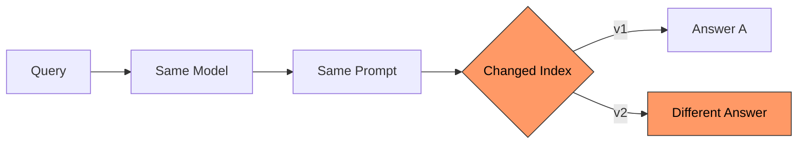
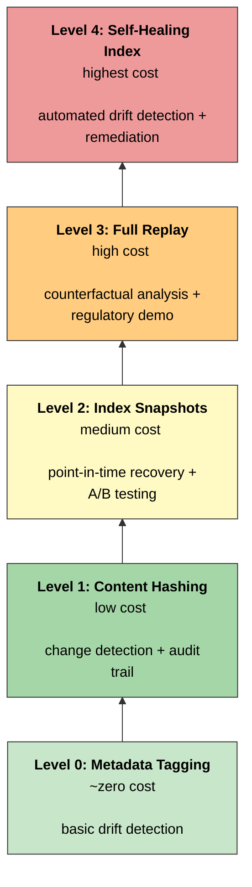
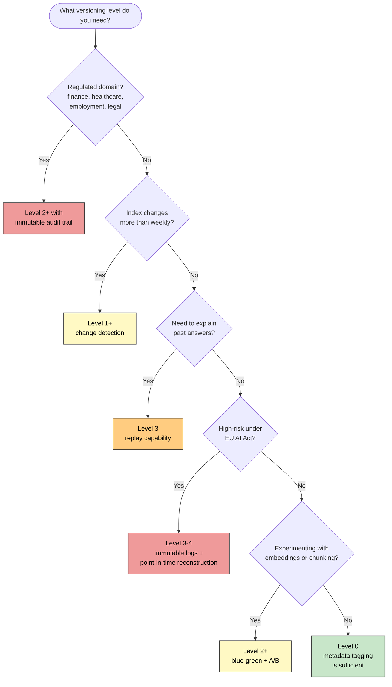

X::[[rag_explainability]]
X::[[RAG_observability]]
X::[[RAG_evaluation]]

## 1. The invisible problem: why RAG systems silently drift

Most teams building Retrieval-Augmented Generation systems obsess over the LLM, its version, its temperature, its prompt. The component that actually changes most often and most quietly is the index: the corpus of documents, their chunked representations, and the embeddings that map them into vector space.

Think about what happens when:

- A policy document is updated, but the old version lingers in the index alongside the new one.
- An embedding model is upgraded, shifting similarity rankings for every query.
- A reindexing job silently drops a document partition due to a pipeline bug.
- A new batch of documents is ingested, and one source starts dominating 80% of retrievals on a topic.

In each case, the RAG system's answers change, but the LLM didn't. The model is the same. The prompt is the same. The retrieval configuration is the same. Yet the user gets a different answer today than they got last week.

Without index versioning, you cannot answer the most basic audit question:

> "Why did the system give this answer on January 10th?"

This is like running a production database without transaction logs or backups. You can serve queries, but you cannot explain, debug, or defend any historical result.

The index is the part of a RAG pipeline that changes the most, and almost nobody versions it.




## 2. Use cases that justify index versioning

Index versioning is not a theoretical exercise. Here are concrete scenarios where missing versioning causes real operational, legal, or quality failures.

### 2.1 Debugging and root cause analysis

Answer quality suddenly degrades. Users report that the system "stopped knowing" about a topic, or started contradicting itself. The engineering team investigates:

- Was it a model change? No, same model, same temperature.
- Was it a prompt change? No, same template.
- Was it an index change? Unknown.

Without index versioning, you cannot isolate retrieval drift from generation drift. You're debugging blind. With version tags on every retrieval request, you can immediately correlate quality drops with specific index changes: "Hallucination rate jumped 15% after `index_v23` was deployed, which coincided with a re-chunking of the legal policy corpus."

### 2.2 Data drift detection

The knowledge base is not static. Documents are added, updated, and removed. Embedding models are upgraded. Chunking strategies evolve.

Index versioning lets you track:

- Corpus drift: How many documents were added or removed between versions?
- Embedding drift: Did switching from `text-embedding-ada-002` to `text-embedding-3-large` change retrieval behavior?
- Source dominance shifts: Is one internal document now responsible for 70% of answers on a topic, when it used to be 30%?

These are not hypothetical concerns. In enterprise deployments, source dominance drift is one of the most common causes of biased or narrow answers, and it is invisible without versioned tracking.

### 2.3 Regulatory compliance and audit

This is where index versioning goes from "nice to have" to "legally required."

Under the EU AI Act (Regulation 2024/1689), high-risk AI systems must maintain records sufficient to reconstruct past decisions. If a RAG system supports employment decisions, credit assessments, or healthcare recommendations, a regulator may ask:

> "Reconstruct the knowledge base state and the retrieval trace for the answer provided to user X on date Y."

Without index versioning, this is impossible.

In financial services, auditors need to verify what knowledge base was active when an AI-assisted recommendation was generated. In healthcare, regulators need to confirm which clinical guidelines were indexed at the time of an AI-supported diagnosis.

### 2.4 Reproducibility for evaluation

RAG evaluation is meaningless without controlled variables. If you're comparing two retrieval strategies, two embedding models, or two chunking approaches, you need to hold the index constant, or at least know exactly how it differed.

Index versioning gives you:

- A/B testing of embedding models with rollback to the control version.
- Regression testing: "Did the new index version degrade performance on our golden test set?"
- Longitudinal evaluation: tracking quality metrics across index versions over months.

### 2.5 Incident response and rollback

A corrupted ingestion pipeline indexes the wrong documents. A hallucination spike is traced to a specific batch of poorly formatted PDFs. A critical policy document was accidentally excluded during re-indexing.

In each case, the response must be fast:

1. Identify the problematic index version.
2. Rollback to the last known-good version.
3. Serve from the rolled-back index while the issue is resolved.

Without versioning, step 1 is a forensic investigation, step 2 is impossible, and step 3 requires rebuilding the entire index from scratch.

### 2.6 Counterfactual replay

For bias investigations and fairness audits, you need to ask:

> "What would the system have answered with last month's index?"

This requires the ability to replay a query against a historical index state. Counterfactual replay is the best method we have for demonstrating that a system change improved (or degraded) fairness, accuracy, or safety.


## 3. What exactly needs versioning?

People often equate "index versioning" with "snapshotting the vector store." That's necessary but not enough. A RAG index is a composite artifact made of multiple independently changing components:

| Component | What changes | Why it matters |
|---|---|---|
| Document corpus | Documents added, removed, or updated | The content of the knowledge base |
| Chunk boundaries | Chunking strategy or parameters change | Same document produces different retrieval units |
| Embedding model | Model version upgraded | Same text maps to different vectors |
| Vector index structure | HNSW/IVF parameters, rebuild | Approximate search behavior changes |
| Metadata and filters | ACLs, tags, timestamps, source labels | What is retrievable changes |
| Prompt templates | System prompt evolves | How retrieved context is used changes |

A "version" is the combination of all these, not just the vector snapshot. If you version the vectors but not the chunking strategy, the same document will produce different answers and you won't know why.

In practice, your version identifier should encode or reference all of these components. A simple approach is a composite version string or a version manifest:

```json
{
  "index_version": "v47",
  "corpus_hash": "a3f8c1...",
  "chunk_strategy": "semantic_v2",
  "embedding_model": "text-embedding-3-large",
  "embedding_model_version": "2025-09",
  "vector_index_type": "HNSW",
  "document_count": 14832,
  "last_updated": "2026-02-15T08:30:00Z",
  "prompt_template_version": "v12"
}
```


## 4. Regulatory context: when versioning becomes mandatory

### 4.1 EU AI Act risk classification for RAG

The EU AI Act does not regulate "RAG systems" as a category. It regulates AI systems based on their application domain and impact.

A RAG system becomes high-risk when deployed in:

- Employment and worker management (screening, recruitment, task allocation)
- Access to essential services (credit scoring, insurance, social benefits)
- Education and vocational training (admissions, assessment)
- Law enforcement (evidence evaluation, risk assessment)
- Healthcare (clinical decision support, triage)

A RAG system used as an internal productivity tool (e.g., searching company wikis, drafting emails) is generally limited-risk or minimal-risk. Transparency obligations apply (users must know they're interacting with AI), but the heavy documentation and logging requirements do not.

For deployers integrating third-party LLMs into RAG pipelines: even if the base model is compliant, your retrieval layer, index, and data governance are your responsibility. The model provider's compliance does not cover your index.

### 4.2 What the regulation actually requires

For high-risk systems, the EU AI Act mandates:

- Article 12 (Record-Keeping): Automatic logging of events sufficient to trace system behavior throughout its lifecycle. For RAG, this means logging retrieval traces, index versions, and context assembly decisions, not just input/output.
- Article 11 (Technical Documentation): Description of the system architecture, data sources, training data (or in RAG's case, indexed data), and their versions.
- Article 14 (Human Oversight): The system must allow effective human supervision, including the ability to review retrieval results and override decisions.
- Article 9 (Risk Management): Ongoing monitoring, testing, and mitigation, which for RAG includes detecting index drift, evaluating retrieval quality, and maintaining rollback capability.

The regulation does not require opening neural weights or explaining attention patterns. It requires system-level traceability and governance. Index versioning is the mechanism that makes this possible for the retrieval layer.

### 4.3 Proportional versioning: match effort to risk

The principle here is proportionality. Not every RAG system needs a full replay architecture. But every RAG system needs *some* level of version tracking.

| Risk level | What to track | How to implement |
|---|---|---|
| Low risk (internal assistant) | Embedding model version, document count, last update timestamp | Metadata tags on telemetry spans |
| Medium risk (decision support) | Above + document hash sets, retrieval traces, index snapshot references | Structured audit events with blob storage references |
| High risk (regulatory decisions) | Above + full replay capability, immutable audit trail, point-in-time index reconstruction | Time-travel capable vector DB + archived prompts + evaluation metrics store |

Don't over-engineer for low-risk systems. Don't under-engineer for high-risk systems. The cost of getting this wrong runs in both directions: wasted engineering effort on one end, regulatory exposure on the other.


## 5. Solution architectures: from lightweight to full replay



### 5.1 Level 0: metadata tagging (minimum viable versioning)

The cheapest possible starting point. Tag every retrieval request with basic version metadata:

- `index_version`, a monotonically increasing identifier
- `embedding_model_version`, which model generated the vectors
- `document_count`, how many documents are in the index
- `last_updated_timestamp`, when the index was last modified

Store these as OpenTelemetry span attributes on every `rag.retrieval` span.

Cost: Near zero.
Value: Basic drift detection, version correlation with quality metrics, and historical analysis.

This is the absolute minimum. If you are not doing this today, start here.

### 5.2 Level 1: content hashing and change detection

At ingestion time, compute a hash for each document and each chunk. Store a `document_hash_set_id` that uniquely identifies the set of documents (and their versions) in the index.

This gets you:

- Change detection without diff storage: know *that* the index changed between v46 and v47, and *which documents* changed.
- Selective re-embedding: only re-embed documents whose content hash changed, saving API costs.
- Audit trail: prove exactly which document versions were indexed at any point.

A practical schema extension for pgvector or similar:

```sql
ALTER TABLE embeddings ADD COLUMN content_hash TEXT;
ALTER TABLE embeddings ADD COLUMN model_version TEXT;
ALTER TABLE embeddings ADD COLUMN indexed_at TIMESTAMP DEFAULT NOW();
```

This pattern is well-documented in production pgvector deployments where content hash and text diff ratios determine whether re-embedding is necessary.

### 5.3 Level 2: index snapshots with point-in-time recovery

This is where you gain the ability to reconstruct past index states.

Several approaches, depending on your vector store:

Database-native time travel:
- LanceDB provides built-in versioning with zero-cost snapshots. Every mutation creates a new version. You can check out any historical version and query against it.
- Qdrant supports collection snapshots that can be stored and restored.
- Milvus offers point-in-time recovery through its storage layer.

Alias-based zero-downtime deployment:
- In Elasticsearch/OpenSearch, create timestamped indexes (`rag_index_2026_02_15`) and use aliases (`rag_index_current`) to swap atomically. Old indexes remain queryable for audit.

Storage-based snapshots:
- For FAISS or ChromaDB, periodically snapshot the index files to blob storage (S3, Azure Blob). Tag with the version manifest from Section 3.

Blue-green deployment for model upgrades:
- When upgrading the embedding model, build the new index in parallel. Route a percentage of traffic to the new index. Compare quality metrics. If acceptable, switch the alias. If not, rollback is instantaneous.

### 5.4 Level 3: full replay architecture

Store enough state to deterministically replay any historical request:

1. Index snapshot reference, which version was active
2. Retrieved document IDs and scores, the actual retrieval results
3. Exact prompt sent to LLM, including the assembled context
4. Model version and parameters: temperature, top_p, model name
5. Evaluation metrics: groundedness score, hallucination risk, confidence

With all five, you can answer:

> "What would this query have returned with the index from three months ago?"

This is what makes counterfactual analysis, bias investigations, and regulatory demonstrations possible.

The Drift-Adapter approach offers an interesting optimization here: instead of maintaining full parallel indexes for every embedding model version, use a lightweight learned transformation layer to map new query embeddings into the legacy embedding space. This achieves 95-99% of retrieval performance recovery at a fraction of the storage cost.

### 5.5 Level 4: self-healing index with drift detection

The most mature pattern: the index monitors its own health and triggers corrective actions.

Continuous monitoring:
- Track retrieval quality metrics (precision@k, nDCG, confidence score distributions) per index version.
- Monitor content freshness: flag embeddings older than a configurable threshold.
- Detect semantic drift: compare embedding distributions between index versions.

Automated drift detection signals:
- Content hash changes without corresponding re-embedding
- Retrieval score distribution shift beyond a threshold
- Embedding age exceeding freshness policy
- Source dominance index crossing a configured limit

Automated remediation:
- Trigger selective re-embedding for stale content
- Alert on anomalous quality metric changes
- Initiate alias-based index rebuild if drift exceeds tolerance

This pattern has been demonstrated in production using Elasticsearch with alias-based rebuilds, where the system continuously monitors query quality and initiates zero-downtime reindexing when drift is detected.


## 6. Implementing observability around index versions

### 6.1 OpenTelemetry span design

Model every RAG request as a span hierarchy. The `index.version` attribute must be present on the root span and the retrieval span:

```
rag.request (root span)
  ├── index.version: "v47"
  ├── embedding.model: "text-embedding-3-large"
  ├── rag.retrieval
  │     ├── top_k: 5
  │     ├── retrieved_doc_ids: ["doc_123", "doc_456", ...]
  │     ├── retrieval_scores: [0.92, 0.87, ...]
  │     └── filter_applied: true
  ├── rag.context_build
  │     └── context_token_count: 2400
  ├── rag.generation
  │     ├── model: "gpt-4o"
  │     └── temperature: 0.1
  └── rag.evaluation
        ├── groundedness_score: 0.91
        └── hallucination_risk: 0.08
```

This structure is natively understood by Azure Application Insights, Jaeger, SigNoz, and other OpenTelemetry-compatible backends.

### 6.2 Metrics to track

| Metric | What it reveals | Alert threshold (example) |
|---|---|---|
| Index freshness | Time since last index update | > 7 days for active knowledge bases |
| Document churn rate | Additions/removals per period | > 20% churn in 24 hours |
| Embedding model version distribution | Mixed model versions in index | Any version mismatch |
| Retrieval score distribution | Shift in confidence over time | Mean score drops > 10% week-over-week |
| Source dominance index | Single source answering disproportionately | Any source > 60% of retrievals for a topic |
| Unsupported claim rate | Claims not grounded in retrieved context | > 5% of responses |

### 6.3 Alerting on index-related anomalies

Configure alerts for:

- Hallucination rate spike within 24 hours of a reindexing event
- Sudden drop in average retrieval confidence scores
- Unexpected change in document count (indicating accidental deletion or duplication)
- Retrieval latency spike (possibly caused by index corruption or misconfiguration)

The important thing is correlating quality metrics with index version transitions. Without the version tag, an alert tells you something is wrong. With it, the alert tells you *what caused it*.

### 6.4 Governance dashboards

For teams operating RAG in regulated environments:

- Index version timeline with quality metrics overlaid, so you can see exactly when quality changed and which index version was responsible.
- Document lifecycle view: when was each document added, modified, or removed from the index?
- Cross-version comparison: side-by-side retrieval results for the same query across two index versions.
- Regulatory audit view: for a given date range, show all index versions that were active and their associated quality metrics.


## 7. Practical decision framework

Use this decision tree to choose your versioning level:




## 8. Common pitfalls

**You version the vectors but forget the chunking strategy.** The same document, chunked differently, retrieves differently and answers differently. Change your chunking approach without bumping the index version and your version history lies to you.

**Nobody tracks prompt template changes.** Index is the same. Model is the same. But someone tweaked the system prompt last Tuesday, and now identical retrieved context produces different answers. If prompt versions aren't in your audit trail, you have a blind spot.

**You snapshot the whole index when you don't need to.** A million documents at 1536 dimensions is several gigabytes per snapshot. Often, storing the document hash set, the embedding model version, and the index config is enough to rebuild the index on demand. You don't always need the raw vectors sitting in cold storage.

**No retention policy.** Keeping every version forever gets expensive and may run afoul of GDPR data minimization rules. Set retention windows based on actual regulatory requirements: maybe six months for an internal tool, five to ten years for healthcare or finance.

**You treat versioning as a one-time setup.** Pipelines change. New data sources show up. Embedding models get upgraded. Chunking strategies evolve. If your versioning system can't keep up, it becomes stale metadata that nobody trusts. Build it as infrastructure you maintain, not a script you ran once.


## 9. Index versioning as a first-class concern

The retrieval index is the part of your RAG system that changes the most and gets governed the least. It shifts more often than the model, more quietly than the prompt, and its effect on answer quality is larger than either.

Versioning your index is not optional for any team that cares about debugging, compliance, or evaluation. Without it, you can't explain past answers, you can't detect drift, and you can't roll back when something breaks.

How much versioning you need depends on what's at stake:

- Level 0: tag every request with `index_version` and `embedding_model_version`. It costs nothing. Do this today.
- Level 1-2: add these when your index changes often or when someone asks why the system gave a particular answer last month.
- Level 3-4: invest here when regulators require it or when your system's outputs carry real consequences for real people.

The question most RAG systems can't answer today is straightforward:

> "What did the system know, and how did it use that knowledge, on a specific date?"

If you can answer that, you're ahead of almost everyone.
